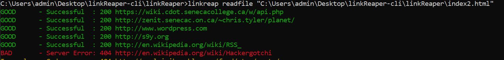

# linkReaper-cli - Release 0.1
A Python cli tool for finding dead links in html files and 
websites. Completed as part of DPS909 open-source course for
Seneca College.

## Functionalities and Features

linkReaper searches through html files stored locally and those pulled
from the web and determines whether any of the links in file are dead. It collects the link's response and then displays 
the status code and the corresponding link with a short description
of the result. These are color coded for the user's convenience and for easy identification of dead links.
   

### Optional Features

* Looks through a webpage for dead links given the url
* Colourized output
    * Red for bad urls
    * Green for good urls
    * Yellow for any urls with abnormal/unknown behaviour
* Option to check if http links work as https when looking through both local files and web pages
    * all http links found will have their scheme changed to https and will output the result
* Optimized to search only through the headers rather than full bodies
    * Doesn't download the full page when looking for a response
* Option to only output only good, only bad and all links
    * good option will only output links with 200 response code
    * bad option will output anything else
    * all option is default and will output all
* Option to have the outputs in json format
    * This works with the good,bad and all output options
 
## Usage

This program has two main capabilities:
1. Find broken links in local html files
2. Find broken links in a website given the url

Entering the program name with no arguments will show the help page.

#### Local files
##### options
**-s , --s**  
Checks if http links works as https 

**-bad, --b**  
Outputs only the links that don't have a successful response

**-good, --g**  
Outputs only the links that have a successful response

**-all, --a**  
The default, outputs all the links

**-json, --j**  
Outputs the results as a json array. This options works with the '-good', '-all', and '-bad' options.

Command:  
Look through local file

    linkreaper readfile [file path]

Check if the http links work with the https scheme

    linkreaper readfile -s [file path]
    
Have all the good links outputted in json format

    linkreaper readfile --g --j [filepath]   
#### Website
Command:  
Look through a webpage

    linkreaper readwebsite [website url]

Check if the http links work with the https scheme

    linkreaper readwebsite -s [website url]
    
Have all the http links that don't work as https outputted as json
    
    linkreaper readwebsite -s --b --j [website url]    

## Coverage

    pip install coverage

for code coverage

## releases
This project has been released on [pypi](https://pypi.org/project/linkreaper/).
To install execute the following command in your terminal.

    pip install linkreaper

## Dependencies
* [Click](https://click.palletsprojects.com/en/7.x/) - Package for making cli tools    
* [Colorama](https://pypi.org/project/colorama/) - Required for colour on Windows
* [urllib3](https://urllib3.readthedocs.io/en/latest/) - Used to manage connections and make requests
* [certifi](https://pypi.org/project/certifi/) - Validating certificates
